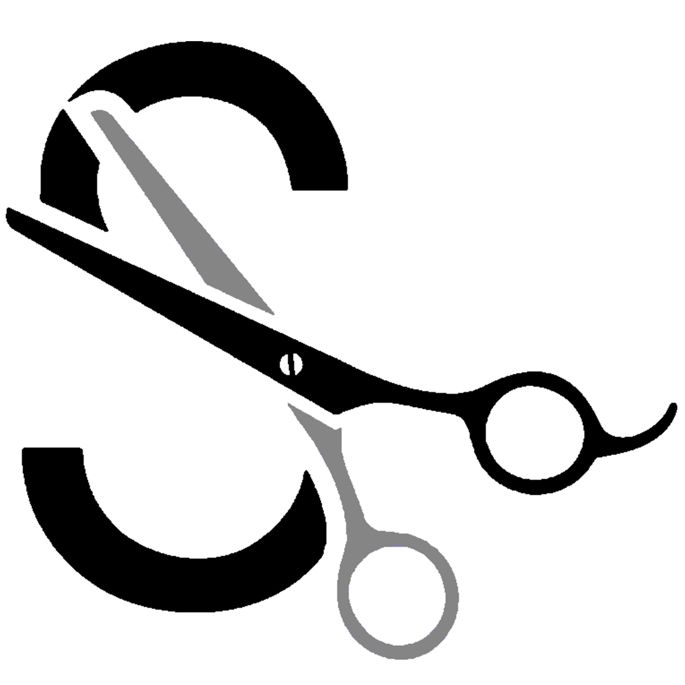
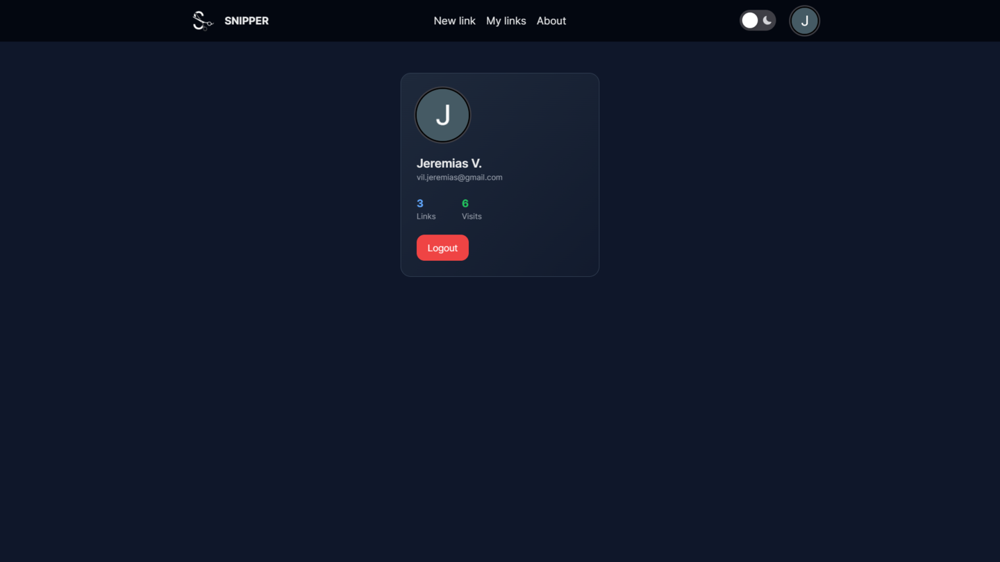

This is a [Next.js](https://nextjs.org/) project implementing [TypeScript](https://www.typescriptlang.org/), [NextAuth](https://next-auth.js.org/), [Next-Themes](https://www.npmjs.com/package/next-themes), [NextUI](https://nextui.org/), [Framer Motion](https://www.framer.com/motion/), [Prisma](https://www.prisma.io/), [PostgreSQL](https://www.postgresql.org/) and [Tailwind CSS](https://tailwindcss.com/).



# Snipper
A simple URL shortener/tracker. It provides you with a shorten url and let you know how many clicks it received.

## Screenshots

### Landing


### Form to create a new Link


### Modal to copy the new link


### My Links section


### Light Theme


### Profile section


## Getting Started

First, run the development server:

```bash
npm run dev
# or
yarn dev
# or
pnpm dev
# or
bun dev
```

Open [http://localhost:3000](http://localhost:3000) with your browser to see the result.

You can start editing the page by modifying `app/page.tsx`. The page auto-updates as you edit the file.

This project uses [`next/font`](https://nextjs.org/docs/basic-features/font-optimization) to automatically optimize and load Inter, a custom Google Font.

## Learn More

To learn more about Next.js, take a look at the following resources:

- [Next.js Documentation](https://nextjs.org/docs) - learn about Next.js features and API.
- [Learn Next.js](https://nextjs.org/learn) - an interactive Next.js tutorial.

You can check out [the Next.js GitHub repository](https://github.com/vercel/next.js/) - your feedback and contributions are welcome!

## Deploy on Vercel

The easiest way to deploy your Next.js app is to use the [Vercel Platform](https://vercel.com/new?utm_medium=default-template&filter=next.js&utm_source=create-next-app&utm_campaign=create-next-app-readme) from the creators of Next.js.

Check out our [Next.js deployment documentation](https://nextjs.org/docs/deployment) for more details.
